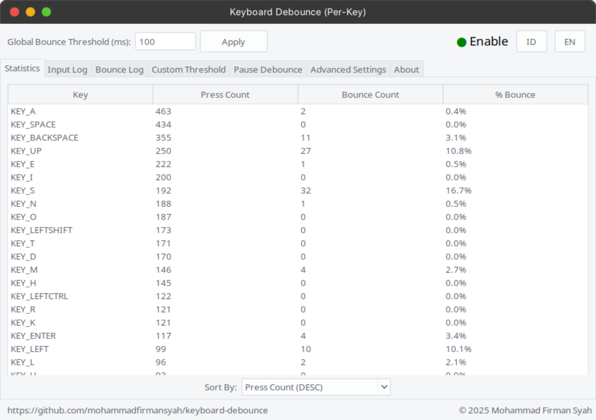
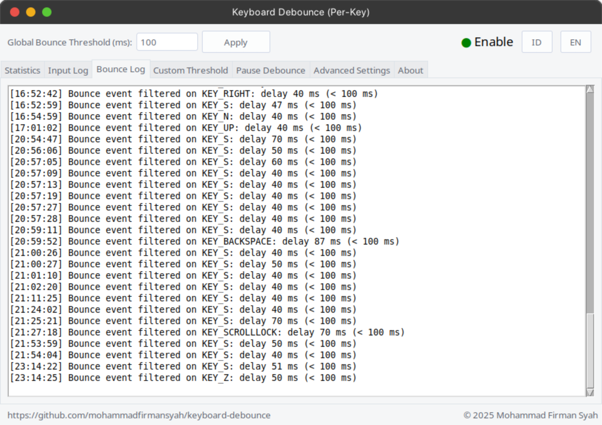

<!-- Screenshot Section -->
<p align="center">
  
  
</p>
 
<div align="center">
 <a href="https://github.com/mohammadfirmansyah/keyboard-debounce/commits/main"></a>
 <a href="https://github.com/mohammadfirmansyah/keyboard-debounce/commits/main"></a>
 <!-- <a href="https://github.com/mohammadfirmansyah/keyboard-debounce/releases/latest"></a>
 <a href="https://github.com/mohammadfirmansyah/keyboard-debounce/releases/latest"></a> -->
</div>

# Keyboard Debounce

**Keyboard Debounce** adalah aplikasi Python untuk menyaring (debounce) input dari **perangkat keyboard**. Aplikasi ini mencegah masuknya event _bounce_ atau _chattering_ yang terjadi ketika tombol ditekan dalam interval waktu yang sangat singkat, sehingga hanya event yang valid saja yang diteruskan ke sistem.

Aplikasi ini cocok untuk mengurangi kesalahan input pada keyboard dan memiliki fitur-fitur yang dapat disesuaikan melalui antarmuka grafis maupun file konfigurasi.

## Fitur Utama

1. **Debounce Input Keyboard Secara Real-Time**  
   - Memfilter _bounce_ berdasarkan dua mode deteksi:
     - **Key Down:** Validasi dilakukan saat tombol ditekan.
     - **Key Up:** Validasi berdasarkan selisih waktu antara penekanan dan pelepasan tombol.

2. **Antarmuka GUI Modern & Multibahasa**  
   - Tampilan GUI menggunakan [ttkthemes](https://pypi.org/project/ttkthemes/) dengan tema `"arc"`.
   - Mendukung dua bahasa: **Bahasa Indonesia** dan **English**. Ganti bahasa secara langsung melalui tombol **ID** dan **EN** di pojok kanan atas.

3. **Pengaturan Konfigurasi & Log yang Persisten**  
   - **config.txt** menyimpan pengaturan seperti threshold global, mode deteksi (_down/up_), custom threshold per tombol, shortcut untuk pause/continue, serta pengaturan _repeat key_ (rate & delay).
   - Log event disimpan ke:
     - **log_input.txt** untuk event keyboard yang valid.
     - **log_bounce.txt** untuk event yang difilter sebagai _bounce_.
   - Semua file konfigurasi dan log disimpan dalam direktori yang sama dengan file `debounce_keyboard.py`.

4. **Custom Threshold Per Tombol**  
   - Atur nilai threshold khusus untuk tombol tertentu melalui tab **Custom Threshold** di GUI.

5. **Shortcut Pause/Continue**  
   - Atur tombol shortcut untuk menghentikan (_pause_) dan melanjutkan (_continue_) proses debounce secara manual melalui tab **Pause Debounce**.

6. **Repeat Key Functionality**  
   - Fitur _repeat key_ dengan pengaturan rate (keys per detik) dan delay sebelum pengulangan ditekan, dapat diatur di tab **Advanced Settings**.

7. **Dukungan QEMU/KVM**  
   - Opsi **Force Disable** debounce saat mendeteksi QEMU/KVM aktif agar tidak terjadi konflik dengan _evdev_.

8. **Single Instance & Auto-Restart**  
   - Aplikasi memastikan hanya satu instance yang berjalan dengan menggunakan file `debounce_keyboard.pid`.
   - Jika aplikasi dijalankan ulang, instance sebelumnya akan dihentikan secara otomatis dan digantikan dengan instance baru.

9. **Mode Background (Tanpa GUI)**  
   - Dapat dijalankan sebagai _service_ atau di latar belakang menggunakan argumen `--nogui`.

10. **Dukungan Wayland**  
    - Aplikasi ini telah mendukung sistem Wayland. (Pengujian lebih dominan pada sistem Wayland; pada sistem X11 belum diuji secara menyeluruh.)

## System Requirements

- **Python 3**  
- **pip3**  
- Library Python: `evdev`, `python-uinput`, `pygame`, dan `ttkthemes`  
- Sistem operasi Linux (disarankan menggunakan distribusi yang mendukung Wayland, meskipun aplikasi juga dapat berjalan pada sistem X11 dengan catatan pengujian belum optimal pada X11).

### Memasang Python 3 & pip3

1. **Memasang Python 3**  
   Jika Python 3 belum terpasang, Anda dapat memasangnya melalui _package manager_ sesuai sistem operasi Anda. Contoh:

   - **Debian/Ubuntu:**
     ```bash
     sudo apt update
     sudo apt install python3
     ```
   - **Fedora:**
     ```bash
     sudo dnf install python3
     ```
   - **Arch Linux:**
     ```bash
     sudo pacman -S python
     ```

2. **Memasang pip untuk Python 3**  
   Pastikan pip (pip3) sudah terpasang. Jika belum, gunakan perintah berikut:

   - **Debian/Ubuntu:**
     ```bash
     sudo apt install python3-pip
     ```
   - **Fedora:**
     ```bash
     sudo dnf install python3-pip
     ```
   - **Arch Linux:**
     ```bash
     sudo pacman -S python-pip
     ```

3. **Instalasi Library yang Diperlukan**  
   Meskipun script `debounce_keyboard.py` akan memasang package yang belum terinstal secara otomatis saat dijalankan pertama kali, Anda juga dapat memasangnya secara manual dengan:
   ```bash
   sudo pip3 install --break-system-packages evdev python-uinput pygame ttkthemes
   ```

## Struktur File

Pada direktori instalasi (misalnya `~/keyboard-debounce`), terdapat file-file berikut:

- **debounce_keyboard.py**  
  _Script_ utama aplikasi.
- **config.txt**  
  Menyimpan konfigurasi seperti threshold, bahasa, mode deteksi, custom threshold, shortcut pause/continue, serta pengaturan repeat key. File ini dibuat otomatis jika belum ada.
- **log_input.txt**  
  Log event keyboard valid.
- **log_bounce.txt**  
  Log event yang dianggap _bounce_.
- **debounce_keyboard.pid**  
  File PID untuk memastikan hanya satu instance yang berjalan.
- **debounce_keyboard.service** (opsional)  
  Contoh file service systemd untuk menjalankan aplikasi secara otomatis saat boot.
- **README.md**  
  Dokumentasi aplikasi ini.

## Instalasi & Persiapan

1. **Kloning Repositori**  
   ```bash
   git clone https://github.com/mohammadfirmansyah/keyboard-debounce.git ~/keyboard-debounce
   ```
2. **Masuk ke Direktori**  
   ```bash
   cd ~/keyboard-debounce
   ```

## Cara Menjalankan

### 1. Mode GUI (Default)
Jalankan dengan perintah:
```bash
sudo python3 ~/keyboard-debounce/debounce_keyboard.py
```
Pada mode ini:
- Antarmuka grafis **Keyboard Debounce** akan muncul.
- Anda dapat mengubah **Global Bounce Threshold (ms)** di bagian atas, kemudian klik **Terapkan**.
- **Input Log** dan **Bounce Log** akan menampilkan event yang diteruskan dan yang difilter.
- Tab **Custom Threshold** memungkinkan pengaturan threshold khusus per tombol.
- Tab **Pause Debounce** digunakan untuk mengatur shortcut pause dan continue.
- Tab **Advanced Settings** menyediakan opsi _Force Disable_ QEMU/KVM, pilihan mode deteksi (_After Press_ atau _After Release_), serta pengaturan _repeat key_ (rate & delay).

### 2. Mode Background (Tanpa GUI)
Jalankan dengan argumen `--nogui`:
```bash
sudo python3 ~/keyboard-debounce/debounce_keyboard.py --nogui
```
Pada mode ini:
- Aplikasi berjalan di latar belakang tanpa antarmuka grafis.
- Event keyboard tetap dicatat ke `log_input.txt` dan `log_bounce.txt`.

## Menjalankan sebagai Service (Opsional)

Untuk menjalankan aplikasi secara otomatis saat boot, Anda dapat membuat file systemd service. Berikut adalah contoh file `debounce_keyboard.service` (pastikan _WorkingDirectory_ dan _ExecStart_ telah disesuaikan):

```ini
[Unit]
Description=Penyaring Papan Ketik Debounce Service
After=network.target sound.target
Requires=sound.target

[Service]
Type=simple
WorkingDirectory=/home/mohammadfirmansyah/keyboard-debounce
Environment="XDG_RUNTIME_DIR=/run/user/1000"
Environment="SDL_AUDIODRIVER=alsa"
ExecStartPre=/bin/sleep 10
ExecStart=/usr/bin/python3 /home/mohammadfirmansyah/keyboard-debounce/debounce_keyboard.py --nogui
TimeoutStopSec=1
KillMode=control-group
Restart=always

[Install]
WantedBy=multi-user.target
```

Setelah membuat file tersebut, lakukan langkah berikut:
```bash
sudo cp debounce_keyboard.service /etc/systemd/system/
sudo systemctl daemon-reload
sudo systemctl enable debounce_keyboard.service
sudo systemctl start debounce_keyboard.service
```

Untuk memeriksa status:
```bash
sudo systemctl status debounce_keyboard.service
```

## Catatan Penting

1. **Single Instance & Auto-Restart**  
   - File `debounce_keyboard.pid` digunakan untuk memastikan hanya satu instance yang berjalan.  
   - Jika Anda menjalankan ulang `debounce_keyboard.py`, instance lama akan otomatis dihentikan dan digantikan dengan instance baru.

2. **File Konfigurasi & Log**  
   - File `config.txt`, `log_input.txt`, dan `log_bounce.txt` dibuat otomatis di folder yang sama dengan `debounce_keyboard.py`.  
   - Setiap perubahan pada pengaturan (misalnya threshold atau pengaturan repeat key) melalui GUI akan langsung disimpan ke `config.txt`.

3. **Menjalankan dengan Sudo**  
   - Disarankan menjalankan aplikasi dengan `sudo -E` agar _environment_ user (misalnya variable `XDG_RUNTIME_DIR`) ikut terbawa.

4. **Deteksi QEMU/KVM & Force Disable**  
   - Jika opsi **Force Disable** aktif di tab **Advanced Settings**, aplikasi akan berhenti melakukan _grab_ pada keyboard saat QEMU/KVM aktif untuk menghindari konflik dengan _evdev_.

5. **Pengaturan Mode Deteksi & Repeat Key**  
   - Pilih mode deteksi debounce (_After Press_ atau _After Release_) sesuai kebutuhan.  
   - Pengaturan _repeat key_ (rate & delay) juga dapat diatur dan disimpan secara otomatis.

6. **Mode Background & Service**  
   - Untuk penggunaan sebagai service, jalankan aplikasi dalam mode `--nogui` agar debounce aktif sejak boot tanpa memunculkan antarmuka grafis.

7. **Dukungan Wayland**  
   - Aplikasi ini mendukung sistem Wayland. Pengujian telah dilakukan pada lingkungan Wayland meskipun untuk sistem X11 pengujian belum dilakukan secara menyeluruh.

Semoga dokumentasi ini membantu Anda dalam menginstal, mengonfigurasi, dan menjalankan **Keyboard Debounce**. Jika terdapat kendala atau pertanyaan, silakan buka _issue_ di GitHub atau hubungi pengembang.

Selamat mencoba!

## Rencana Update v1.2.0

Pada versi mendatang, direncanakan beberapa peningkatan berikut:
- **Perbaikan Race Condition:** Menangani kondisi perlombaan (_race condition_) ketika service yang sedang berjalan belum sepenuhnya dihentikan sebelum membuka aplikasi baru.
- **Notifikasi dan Sound untuk Mode --nogui:** Menambahkan notifikasi serta efek suara saat aplikasi dijalankan dalam mode background (tanpa GUI).
- **Startup Lebih Cepat:** Menghilangkan delay 10 detik agar aplikasi dapat berjalan lebih cepat pada saat startup.
- **Stabilitas pada X11:** Memastikan aplikasi berjalan dengan stabil di sistem X11.
- **Paket Instalasi All-in-One untuk Linux:** Menyediakan paket instalasi (.deb) yang memudahkan instalasi pada sistem Linux.
- **Dukungan Multi-Platform:** Menambahkan dukungan untuk pembuatan paket instalasi bagi perangkat Windows (.exe) dan macOS (.dmg).
