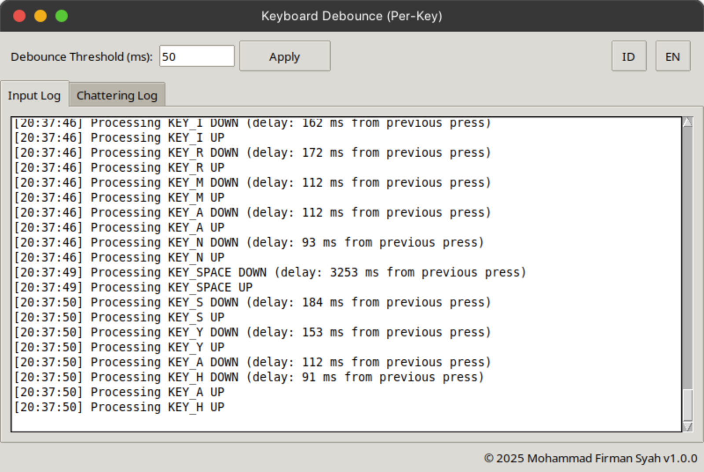
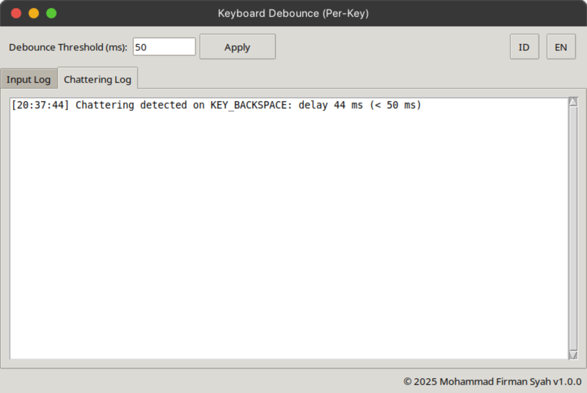

<!-- Screenshot Section -->
<p align="center">
  
  
</p>
 
 <a href="https://github.com/mohammadfirmansyah/keyboard-debounce/commits/main"></a>
 <a href="https://github.com/mohammadfirmansyah/keyboard-debounce/commits/main"></a>
 <!-- <a href="https://github.com/mohammadfirmansyah/keyboard-debounce/releases/latest"></a>
 <a href="https://github.com/mohammadfirmansyah/keyboard-debounce/releases/latest"></a> -->

# Keyboard Debounce

**Keyboard Debounce** adalah aplikasi Python untuk menyaring (debounce) input dari perangkat keyboard secara per-tombol guna mengatasi _chattering_. Aplikasi ini mendeteksi penekanan tombol yang terjadi terlalu cepat (misalnya, kurang dari 50 ms) dan memblokirnya sehingga hanya event valid yang diteruskan ke sistem. Selain itu, aplikasi ini mendukung dua mode:

- **Mode GUI (default):** Menampilkan antarmuka grafis dengan log input dan log chattering, serta opsi untuk mengganti bahasa (Bahasa Indonesia / English).
- **Mode Background:** Aplikasi berjalan sebagai _service_ (tanpa GUI) dan menyimpan log secara persisten ke file teks.

Konfigurasi (seperti _threshold_ dan bahasa) serta log disimpan secara _persisten_ di file teks sehingga log baru selalu ditambahkan ke bawah log lama.

---

## Fitur Utama

- **Debounce Per-Tombol:**  
  - Nilai default _threshold_ adalah 50 ms.
  - Hanya penekanan valid pertama secara global yang dicatat tanpa delay, sedangkan penekanan valid berikutnya menampilkan delay (dalam ms) dari penekanan valid global sebelumnya.
  - Jika penekanan tombol yang sama terjadi dalam interval kurang dari _threshold_, event tersebut dianggap sebagai _chattering_ dan **tidak diteruskan ke sistem**, hanya dicatat di _Log Chattering_.

- **Dukungan Dua Bahasa:**  
  - Antarmuka (UI) dan log mendukung Bahasa Indonesia dan English.  
  - Tombol untuk mengganti bahasa ("ID" dan "EN") diletakkan di sebelah kanan dengan lebar tombol persegi.

- **Persistensi Konfigurasi & Log:**  
  - Konfigurasi disimpan di `config.txt`.
  - Log _input_ disimpan di `log_input.txt` dan log _chattering_ disimpan di `log_chatter.txt` secara _append_, sehingga log lama tidak akan di‑overwrite.

- **Single Instance & Auto-Restart:**  
  - Menggunakan file PID (`debounce_keyboard.pid`) untuk memastikan hanya satu instance aplikasi yang berjalan. Jika aplikasi dijalankan lagi, instance sebelumnya akan dihentikan dan aplikasi direstart.

- **Mode Background:**  
  - Dapat dijalankan tanpa antarmuka (GUI) dengan menggunakan argumen `--nogui`, sehingga cocok untuk dijalankan sebagai _service_.

- **Tema GUI:**  
  - Menggunakan tema ttk “clam” dengan ukuran jendela default 800×500.
  - Terdapat _auto scroll_ untuk log sehingga log baru selalu muncul di bawah tanpa mengganggu posisi scroll.

---

## Struktur File

Pastikan seluruh file berikut berada dalam direktori `~/keyboard-debounce`:

- `debounce_keyboard.py` – Script utama aplikasi.
- `config.txt` – File konfigurasi (akan dibuat otomatis jika belum ada).
- `log_input.txt` – File log untuk event valid (akan dibuat otomatis jika belum ada).
- `log_chatter.txt` – File log untuk event chattering (akan dibuat otomatis jika belum ada).
- `run_debounce.sh` – Shell script untuk menjalankan aplikasi dalam mode background.
- `debounce_keyboard.service` – File _service_ systemd untuk menjalankan aplikasi saat boot.
- `README.md` – Dokumentasi lengkap (file ini).
- Folder `screenshot/` – Berisi screenshot:
  - `screenshot/Log-event.png`
  - `screenshot/Log-chattering.png`

---

## Instalasi dan Persiapan

### Persyaratan
- **Python 3**
- **pip3**
- **evdev** dan **python‑uinput**  
  Jika belum terinstal, skrip `debounce_keyboard.py` akan menginstalnya secara otomatis menggunakan:
  ```bash
  sudo pip3 install --break-system-packages evdev python-uinput
  ```

### Instalasi
1. Clone repositori dengan perintah:
   ```bash
   git clone https://github.com/mohammadfirmansyah/keyboard-debounce.git ~/keyboard-debounce
   ```
2. Pindah ke direktori repositori:
   ```bash
   cd ~/keyboard-debounce
   ```
3. Pastikan file `run_debounce.sh` memiliki hak akses eksekusi:
   ```bash
   chmod +x run_debounce.sh
   ```

---

## Cara Menjalankan Aplikasi

### Mode GUI (Default)
Untuk menjalankan aplikasi dengan antarmuka grafis, cukup jalankan:
```bash
sudo python3 ~/keyboard-debounce/debounce_keyboard.py
```
Aplikasi akan membuka jendela GUI dengan ukuran 800×500.  
- Gunakan kolom **Batas Chattering (ms)** untuk mengubah nilai threshold.
- Tekan tombol **Terapkan** untuk menyimpan konfigurasi (config.txt akan diperbarui).
- Log _input_ dan _chattering_ akan ditampilkan pada tab masing-masing.
- Tombol bahasa **ID** dan **EN** di sebelah kanan memungkinkan Anda mengganti bahasa antarmuka dan log secara dinamis.

### Mode Background (Tanpa GUI)
Untuk menjalankan aplikasi tanpa antarmuka grafis (misalnya, untuk dijalankan sebagai _service_), gunakan argumen `--nogui`:
```bash
sudo python3 ~/keyboard-debounce/debounce_keyboard.py --nogui
```
Dalam mode ini, aplikasi akan menjalankan fungsi _monitor keyboard_ secara terus-menerus dan menyimpan log ke file `log_input.txt` dan `log_chatter.txt`.

---

## Menjalankan Aplikasi sebagai Service

### File Service Systemd: `debounce_keyboard.service`
Simpan file berikut (sesuaikan _WorkingDirectory_ dan _ExecStart_ dengan path absolut ke direktori Anda, misalnya `/home/mohammadfirmansyah/keyboard-debounce`):

```ini
[Unit]
Description=Penyaring Papan Ketik Debounce Service
After=network.target

[Service]
Type=simple
WorkingDirectory=/home/mohammadfirmansyah/keyboard-debounce
ExecStart=/bin/bash /home/mohammadfirmansyah/keyboard-debounce/run_debounce.sh
Restart=always

[Install]
WantedBy=multi-user.target
```

Untuk mengaktifkan service:
```bash
sudo cp debounce_keyboard.service /etc/systemd/system/
sudo systemctl daemon-reload
sudo systemctl enable debounce_keyboard.service
sudo systemctl start debounce_keyboard.service
```

Periksa status service:
```bash
sudo systemctl status debounce_keyboard.service
```

---

## Catatan Akhir

- **Persistensi:**  
  Konfigurasi disimpan di `config.txt`, sedangkan log disimpan di `log_input.txt` dan `log_chatter.txt` secara _append_.  
- **Single Instance:**  
  Aplikasi menggunakan file PID (`debounce_keyboard.pid`) untuk memastikan hanya satu instance yang berjalan. Jika aplikasi dijalankan lagi, instance sebelumnya akan dihentikan dan aplikasi di restart.
- **Auto Scroll:**  
  Log baru akan ditambahkan di bagian bawah dan tampilan akan otomatis bergulir ke bawah.
- **Instalasi Otomatis:**  
  Jika library _evdev_ atau _python‑uinput_ belum terinstal, skrip akan menginstalnya secara otomatis.
- **Mode GUI & Background:**  
  Aplikasi dapat dijalankan dengan atau tanpa antarmuka grafis, sesuai kebutuhan.
- **Service:**  
  Gunakan file service systemd dan shell script untuk menjalankan aplikasi saat boot.

Semoga dokumentasi ini membantu Anda dalam menginstal, mengkonfigurasi, dan menjalankan aplikasi Keyboard Debounce!
